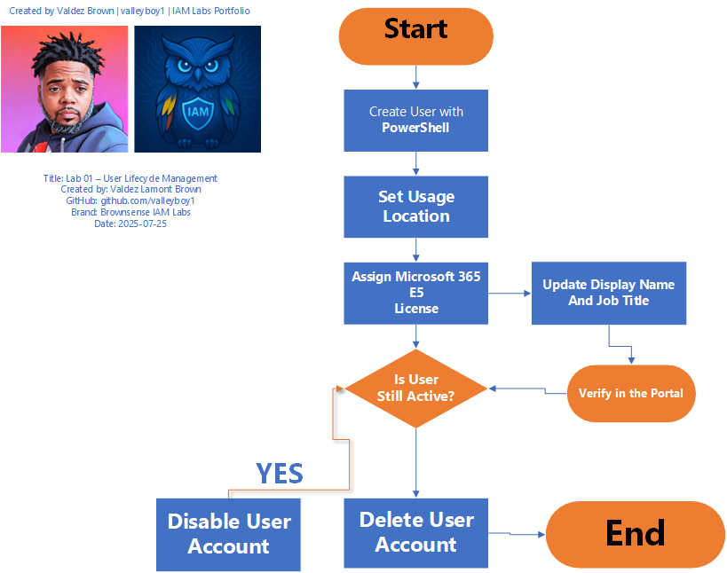

# Lab 01 – User Lifecycle Management in Microsoft Entra ID

## 📘 Overview
This lab demonstrates how to manage a user's full lifecycle in Microsoft Entra ID using PowerShell and the Microsoft Graph SDK.

Key lifecycle steps:
- Create a new user
- Set usage location
- Assign Microsoft 365 license
- Update user info (display name, job title)
- Offboard by disabling or deleting the user

---

## 🧠 Learning Objectives
- ✅ Connect to Microsoft Graph via PowerShell
- ✅ Automate user creation with secure credentials
- ✅ Apply and verify Microsoft 365 E5 license
- ✅ Modify and manage user profile details
- ✅ Handle offboarding scenarios in a secure and auditable way

---

## 📜 Files in this Lab

| File Name | Description |
|-----------|-------------|
| [`Lab1_UserLifecycleManagement_Script.txt`](./Lab1_UserLifecycleManagement_Script.txt) | Full PowerShell script |
| [`Lab1_UserLifecycleManagement_Explanation.txt`](./Lab1_UserLifecycleManagement_Explanation.txt) | Step-by-step breakdown of the script |
| [`Lab1_Screenshot_Checklist.txt`](./Lab1_Screenshot_Checklist.txt) | Plain text list of screenshots to capture |
| [`Lab1_Screenshot_Checklist.md`](./Lab1_Screenshot_Checklist.md) | Markdown version for GitHub display |
| [`/Screenshots/`](./Screenshots) | Screenshots showing execution of each step |
| [`/Diagrams/Lab01_UserLifecycle_Diagram.png`](./Diagrams/Lab01_UserLifecycle_Diagram.png) | Visual diagram of the user lifecycle process |

---

## 🖼️ Diagram

---

## 🎥 Video Demonstration

📺 [Click here to watch the full video on YouTube](https://youtu.be/gCVf0GMI3r0)

---

## 👤 Credits
**Created by:** Valdez Lamont Brown  
**GitHub:** [valleyboy1](https://github.com/valleyboy1)  
**Brand:** Brownsense IAM Labs  
**Date:** July 25, 2025
