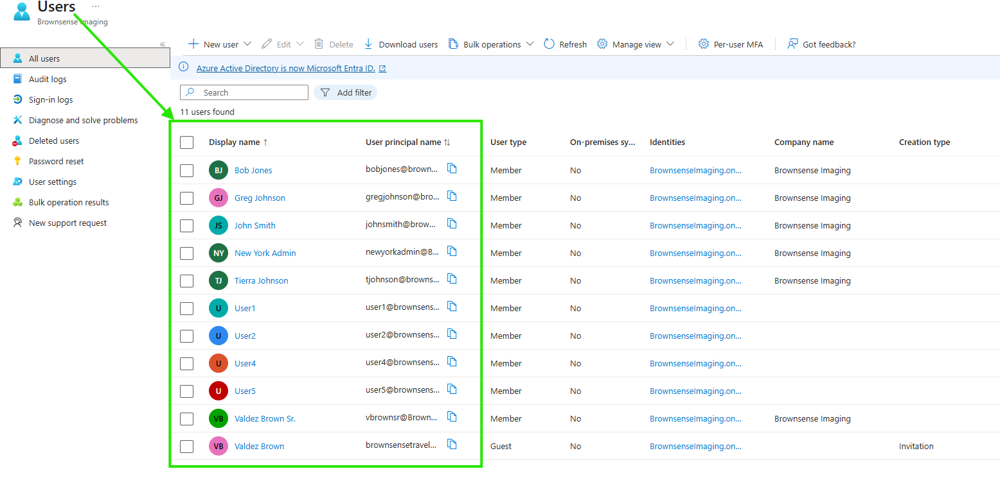
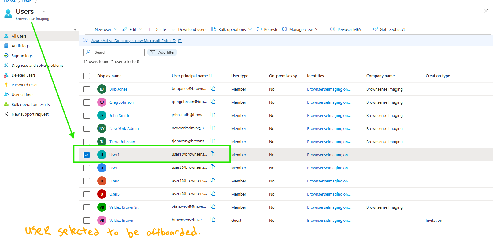
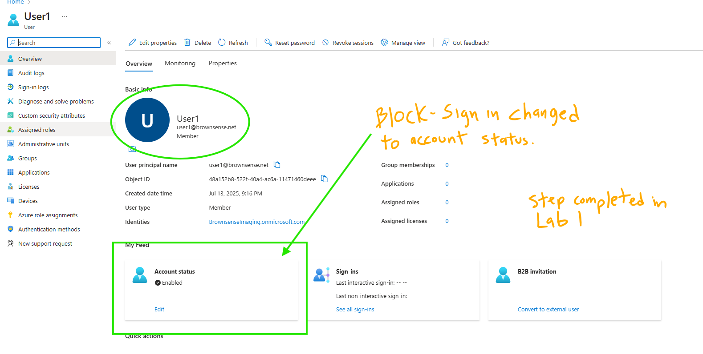
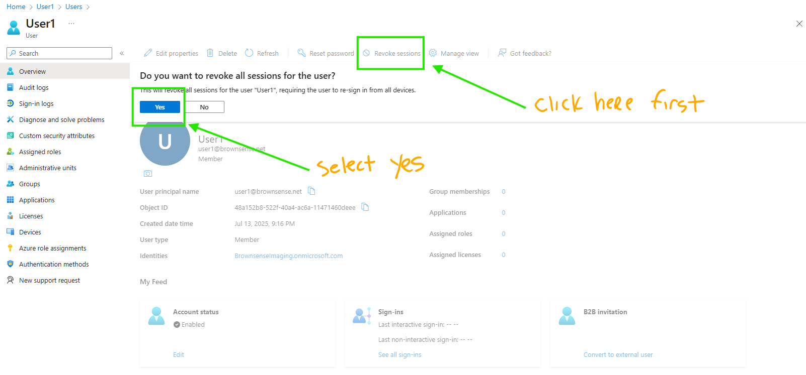
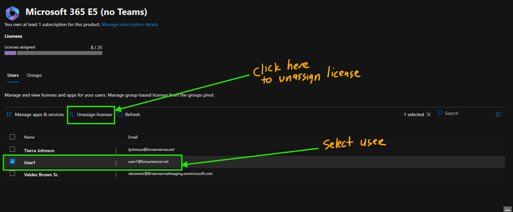
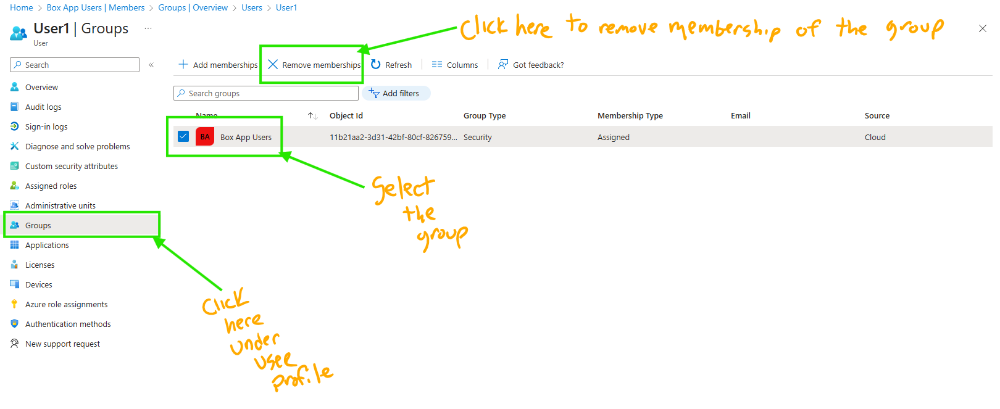
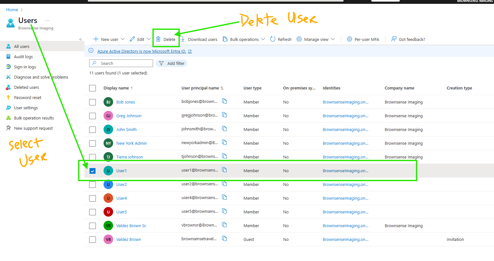

# 🔐 Lab 2 – Lifecycle Offboarding with Microsoft Entra ID

This lab simulates the secure offboarding process for a user in Microsoft Entra ID. Using both **portal navigation** and **PowerShell automation**, I demonstrate how to disable access, revoke sessions, clean up licenses and groups, and (optionally) delete the user account.

---

## 🎯 Lab Objectives

- Block user sign-in access
- Revoke all sign-in sessions
- Remove assigned licenses
- Remove user from groups (e.g., Box App Users)
- Delete user from directory (optional)

---

## 👤 User Offboarded

- **Display Name:** User1  
- **UPN:** `user1@brownsense.net`  
- **Group Membership:** Box App Users

---

## 📺 Lab Walkthrough Video

## 📺 Lab Walkthrough Video

---

## 📄 PowerShell Script

📂 [View Script → Scripts/offboarding_user1.ps1](./Scripts/offboarding_user1.ps1)

This script uses the Microsoft Graph PowerShell SDK to:
- Block sign-in
- Revoke sessions
- Remove licenses
- Remove group membership
- Delete the user

---

## 🖼️ Diagram

This diagram outlines both Portal and PowerShell steps for securely offboarding a user in Microsoft Entra ID.

---

## 📸 Step-by-Step Screenshots (Portal)

### Step 1: View all users  

---

### Step 2: Select User1  

---

### Step 3: Block Sign-In (Done in Lab 1)  

---

### Step 4: Revoke Sessions  

---

### Step 5: Unassign License  

---

### Step 6: Remove from Group  

---

### Step 7: Delete User (Optional)  

---

## 🧠 Key Takeaways

- Offboarding must be systematic: disable, revoke, remove, clean
- PowerShell automates repeatable IAM tasks efficiently
- Group cleanup ensures access is fully removed
- Sessions must be revoked even if account is disabled

---

## 🔗 Back to Portfolio

[⬅️ Return to IAM Labs Portfolio](https://github.com/valleyboy1/iam-labs-portfolio)
