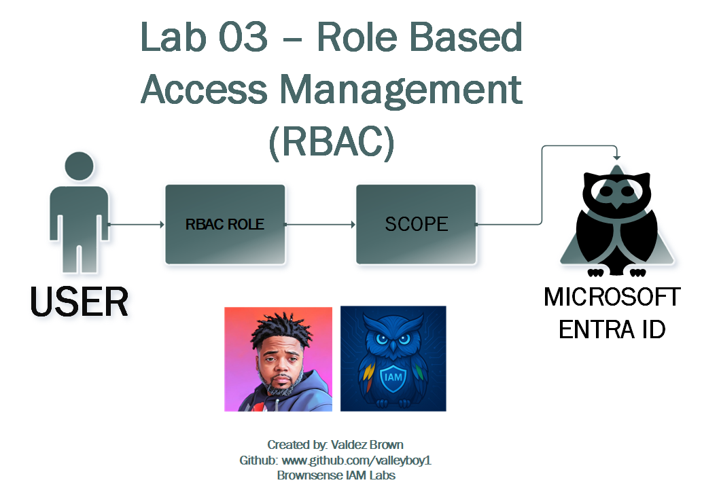
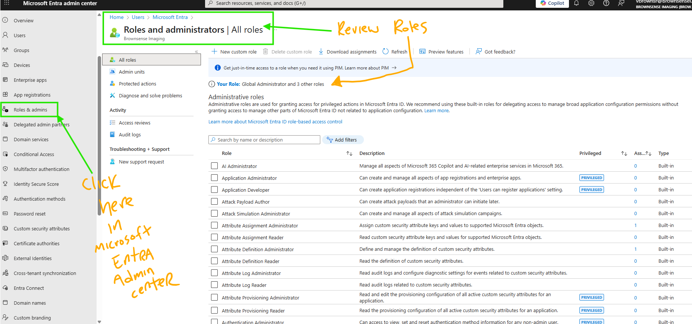
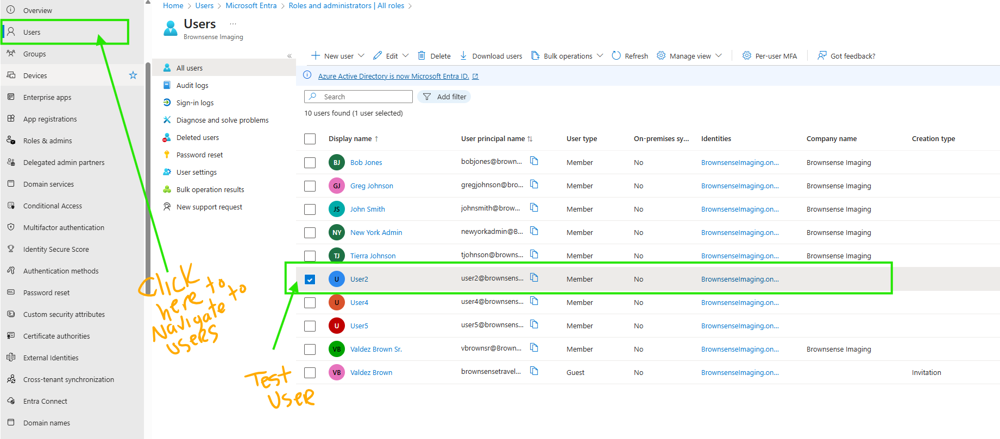
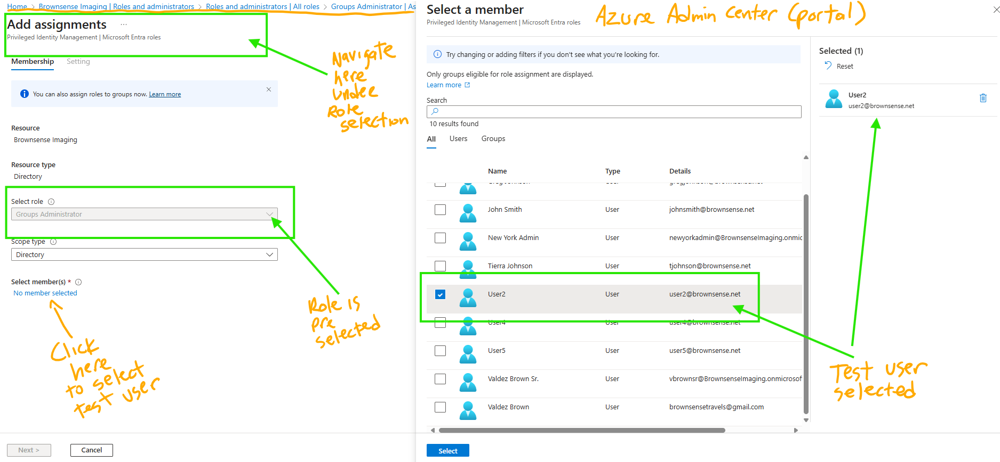
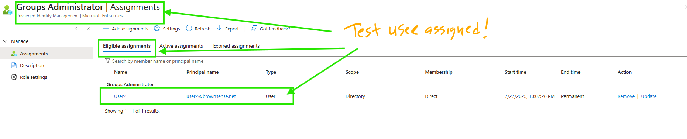

# 🔐 Lab 03 – Role-Based Access Control (RBAC)

**Author:** Valdez Brown  
**Brand:** Brownsense IAM Labs  
**GitHub:** [github.com/valleyboy1](https://github.com/valleyboy1)

---

## 🎯 Objective

Assign and verify the **Azure AD Joined Device Local Administrator** role to a test user using both the **Microsoft Entra Portal** and **PowerShell (Microsoft Graph SDK)**.

---

## 🧠 Overview: What is RBAC?

Role-Based Access Control (RBAC) allows you to assign permissions to users based on their job roles. In Entra ID, RBAC ensures least privilege access by assigning **directory roles** scoped to a tenant or specific resource.

---

## 📊 Lab Architecture



---

## 🖼️ Step-by-Step Screenshots

### 🔹 Step 1: View Built-in Roles


---

### 🔹 Step 2: Select Test User (User5)


---

### 🔹 Step 3: Assign Role in Portal


---

### 🔹 Step 4: Confirm Role Assignment


---

## ⚡ PowerShell Script: Assign Role via Graph

> 💡 `Lab3_Assign_Role.ps1` is included in this folder

```powershell
# Connect to Microsoft Graph
Connect-MgGraph -Scopes "RoleManagement.ReadWrite.Directory", "User.Read.All", "Directory.Read.All"

# Define user and role
$userUPN = "user5@brownsense.net"
$roleName = "Azure AD Joined Device Local Administrator"

# Get user object
$user = Get-MgUser -UserId $userUPN

# Get role definition
$role = Get-MgRoleManagementDirectoryRoleDefinition -All | Where-Object {
    $_.DisplayName -eq $roleName
}

# Assign the role
New-MgRoleManagementDirectoryRoleAssignment `
    -PrincipalId $user.Id `
    -RoleDefinitionId $role.Id `
    -DirectoryScopeId "/"

# Confirm assignment
Get-MgRoleManagementDirectoryRoleAssignment -Filter "principalId eq '$($user.Id)'" -All |
    Where-Object { $_.RoleDefinitionId -eq $role.Id } |
    Format-List Id, PrincipalId, RoleDefinitionId


# 📺 Lab 03 – YouTube Video Demo

**Lab Title:** Role-Based Access Control (RBAC)  
**Author:** Valdez Brown  
**GitHub:** [github.com/valleyboy1](https://github.com/valleyboy1)

---

## 📺 YouTube Video Demo

🎬 Watch the full lab walkthrough on YouTube:  
[](https://youtu.be/URBZ23tY2c0)

> In this demo, I assign the "Azure AD Joined Device Local Administrator" role to a test user using Microsoft Entra ID and PowerShell via Microsoft Graph.

This video demonstrates:
- Assigning the "Azure AD Joined Device Local Administrator" role to User5
- Steps in the Microsoft Entra Portal
- Verifying the assignment using PowerShell (Microsoft Graph SDK)

# 🛠️ Lab 03 – Troubleshooting Log (Markdown Version)

## ❌ Issue 1: `Get-MgDirectoryRoleDefinition` not recognized
**Error Message:**  
`The term 'Get-MgDirectoryRoleDefinition' is not recognized...`

**Fix:**  
Installed the missing module:
```powershell
Install-Module Microsoft.Graph.RoleManagement.Directory -Scope CurrentUser -Force
Import-Module Microsoft.Graph.RoleManagement.Directory
```

---

## ❌ Issue 2: `Install-Module` not recognized
**Error Message:**  
`The term 'Install-Module' is not recognized...`

**Fix:**  
PowerShellGet and PackageManagement modules were broken. They were reinstalled manually by:
- Downloading `.nupkg` files
- Extracting them
- Copying the contents to:
  ```
  C:\Program Files\WindowsPowerShell\Modules\
  ```
- Then importing:
```powershell
Import-Module PowerShellGet -Force
Import-Module PackageManagement -Force
```

---

## ❌ Issue 3: Role Name Not Found
**Error Message:**  
`Role 'Microsoft Entra Joined Device Local Administrator' not found`

**Fix:**  
Discovered the correct role name using:
```powershell
Get-MgRoleManagementDirectoryRoleDefinition -All | Select-Object DisplayName
```
✅ Final role used: `"Azure AD Joined Device Local Administrator"`

---

## ✅ Final Result
All modules were successfully installed, and the role was assigned using a validated PowerShell script.

