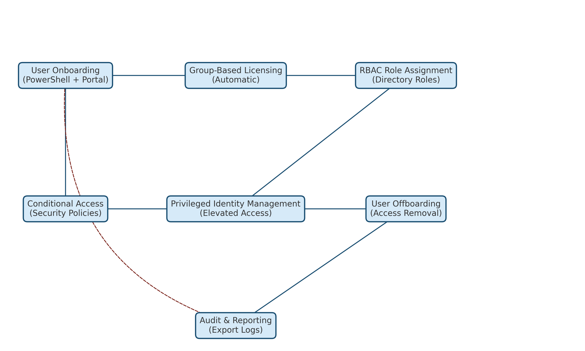

# 🏆 Lab 08 – IAM End-to-End Lifecycle Management Capstone

## Overview
This is the **final capstone lab** in the IAM Labs Portfolio. It combines all major IAM tasks into a single end-to-end scenario, from user onboarding to secure offboarding.  
The scenario simulates a real-world IAM Administrator role for the fictional company **Contoso Corp**.

**Key Components:**
- **User Onboarding** (PowerShell & Portal)
- **Group-Based Licensing**
- **RBAC Role Assignments**
- **Conditional Access Policies**
- **Privileged Identity Management (PIM)**
- **User Offboarding**
- **Audit & Reporting**
- **Automation with Microsoft Graph PowerShell**

---

## 🎯 Scenario
You are tasked with:
1. Creating 3 users (HR, IT, Sales)
2. Assigning licenses automatically through groups
3. Applying role-based access controls
4. Securing access via Conditional Access policies
5. Managing elevated permissions using PIM
6. Offboarding a departing user
7. Exporting audit logs for compliance

---

## 📂 Folder Structure
```
Lab08-End-to-End-Lifecycle/
├── diagrams/               # Lab architecture & flow diagrams
├── docs/
│   ├── Scripts-README.md    # Run order for all scripts
│   ├── Script-Explanations.md # Purpose & breakdown of each script
├── scripts/                 # PowerShell automation scripts
└── screenshots/             # Screenshots from portal steps
```

---

## 📜 Steps Summary
1. **Connect to Microsoft Graph** – `01-Connect-Graph.ps1`
2. **Setup Groups & Licensing** – `02-Setup-Groups-and-Licensing.ps1`
3. **Create Users & Add to Groups** – `03-Create-Users-and-Add-To-Groups.ps1`
4. **Assign RBAC Roles** – `04-RBAC-DirectoryRole-Assignments.ps1`
5. **Configure Conditional Access** – `05-Conditional-Access-Policies.ps1`
6. **Enable PIM & Test Activation** – `06-PIM-Eligibility-and-Activation.ps1`
7. **Offboard User** – `07-Offboarding.ps1`
8. **Export Audit Logs** – `08-Export-Audit-Logs.ps1`
9. **Cleanup** – `99-Cleanup.ps1`

---

## 📺 Video Demonstration
[](https://www.youtube.com/watch?v=OSHOKB4FMwk)  


---

## 📊 Diagram
  
*Diagram shows end-to-end flow: Onboarding → Licensing → RBAC → CA → PIM → Offboarding.*

---

## 🔗 Related Labs
- [Lab 01 – Lifecycle Onboarding](https://github.com/valleyboy1/iam-labs-portfolio/blob/main/Lab01-User-Lifecycle/README1.md)
- [Lab 02 – Lifecycle Offboarding](../Lab02-Lifecycle-Offboarding/README.md)
- [Lab 03 – RBAC Role Assignments](https://github.com/valleyboy1/iam-labs-portfolio/blob/main/Lab03-RBAC-RoleAssignment/README.md)
- [Lab 04 – Conditional Access Policies](../Lab04-Conditional-Access/README.md)
- [Lab 05 – Group-Based Licensing](../Lab05-Group-Based-Licensing/README.md)
- [Lab 06 – Privileged Identity Management](../Lab06-PIM/README.md)
- [Lab 07 – Automation with Graph SDK](https://github.com/valleyboy1/iam-labs-portfolio/blob/main/Lab07-Advanced-Conditional-Access/README.md)
- [Lab 08 – IAM End-to-End Lifecycle](https://github.com/valleyboy1/iam-labs-portfolio/blob/main/Lab08-End-to-End-Lifecycle/README.md)

---

## ⚙️ Requirements
- Microsoft 365 E5 tenant with Entra ID P2
- PowerShell 7+
- `Microsoft.Graph` module
- Global Administrator or equivalent permissions
- Microsoft Visio (for diagram)

---

## 🧹 Cleanup
Run `99-Cleanup.ps1` to remove demo users and CA policies.  
Add `-RemoveGroups` to also delete the HR, IT, and Sales groups.

---

## 📄 Notes
- All CA policies are created in **report-only mode** for safe testing. Change `state` to `"enabled"` in the script once verified.
- PIM steps require switching to the **Graph beta profile**.
- Audit logs are exported as `.csv` for analysis.
